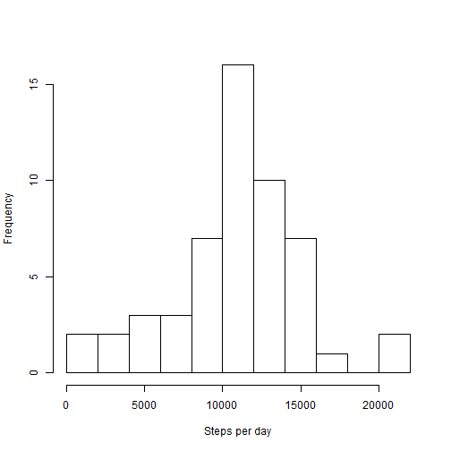
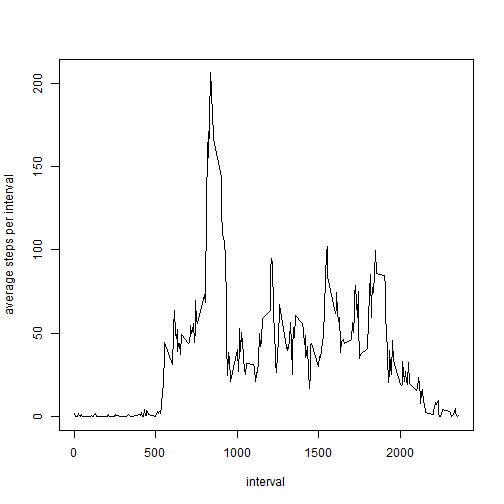
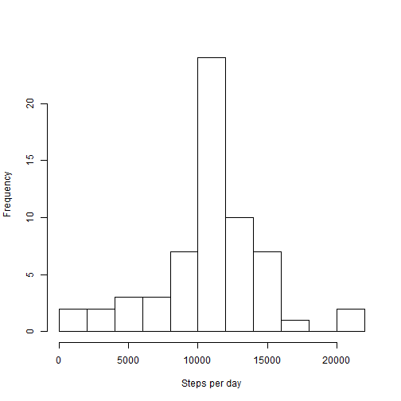
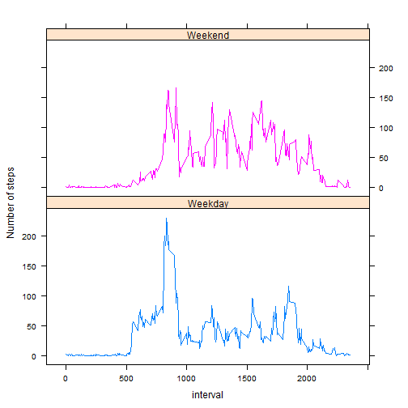

# PA-1: Reproducible Research
=====================================

## Loading and preprocessing the data

- Fork "https://github.com/vranjan/RepData_PeerAssessment1"
- This will download this rmd file and activity.zip files


1. Load data into activityData.
2. coerce the date field from factor into "date".
3. Check the structure of data frame activityData and summarize data.

```r
setwd("./")
# 
activityData <- read.csv(unzip("activity.zip"))
activityData$date <- as.Date(as.character(activityData$date))
head(activityData)
```

```
##   steps       date interval
## 1    NA 2012-10-01        0
## 2    NA 2012-10-01        5
## 3    NA 2012-10-01       10
## 4    NA 2012-10-01       15
## 5    NA 2012-10-01       20
## 6    NA 2012-10-01       25
```

```r
str(activityData)
```

```
## 'data.frame':	17568 obs. of  3 variables:
##  $ steps   : int  NA NA NA NA NA NA NA NA NA NA ...
##  $ date    : Date, format: "2012-10-01" "2012-10-01" ...
##  $ interval: int  0 5 10 15 20 25 30 35 40 45 ...
```

```r
summary(activityData)
```

```
##      steps            date               interval   
##  Min.   :  0.0   Min.   :2012-10-01   Min.   :   0  
##  1st Qu.:  0.0   1st Qu.:2012-10-16   1st Qu.: 589  
##  Median :  0.0   Median :2012-10-31   Median :1178  
##  Mean   : 37.4   Mean   :2012-10-31   Mean   :1178  
##  3rd Qu.: 12.0   3rd Qu.:2012-11-15   3rd Qu.:1766  
##  Max.   :806.0   Max.   :2012-11-30   Max.   :2355  
##  NA's   :2304
```


## What is mean total number of steps taken per day?

1. Save complete cases (rows without NAs) as data.table. 
2. Sum number of steps by date.
3. plot histogram.


```r
library(data.table)
activityDataComplete <- data.table(activityData[complete.cases(activityData), 
    ])
# head(activityDataComplete)
stepsPerDay <- activityDataComplete[, sum(steps), by = "date"]
# stepsPerDay
hist(stepsPerDay$V1, breaks = 9, xlab = "Steps per day", main = "")
```

 


#### Calculate mean and median of the number of steps per day


```r
mean(stepsPerDay$V1)
```

```
## [1] 10766
```

```r
median(stepsPerDay$V1)
```

```
## [1] 10765
```


#### Make a time series plotof the 5-minute interval and the average number of steps taken, averaged across all days.


```r
# 2
stepsPerInterval <- activityDataComplete[, mean(steps), by = "interval"]
# head(stepsPerInterval)
plot(stepsPerInterval, type = "l", ylab = "average steps per interval")
```

 


#### Which 5-minute interval, on average across all the days in the dataset, contains the maximum number of steps?

```r
stepsPerInterval$interval[which.max(stepsPerInterval$V1)]
```

```
## [1] 835
```


## Imputing missing values

####  Total number of missing values in the dataset (i.e. the total number of rows with NAs)


```r
sum(!complete.cases(activityData))
```

```
## [1] 2304
```


#### Fill in all of the missing values in the dataset. 
Replace NAs with average step per interval for the corresponsing interval.


```r
# Impute NAs in activityData with average steps in a given interval Iterate
# over each row of activityData If the value of 'steps' is NA in
# activityData, then find interval for that step in activityData and then
# find the mean step for that interval already calculated and stored in
# stepsPerInterval replace NA with this value.
activityDataImputed <- activityData
for (i in 1:nrow(activityDataImputed)) {
    if (is.na(activityDataImputed[i, ]$steps)) 
        activityDataImputed[i, ]$steps = stepsPerInterval[stepsPerInterval$interval == 
            activityDataImputed[i, ]$interval]$V1
}
# summary(activityDataImputed) head(activityDataImputed) convert
# activityDatImputed from data frame to data table.
activityDataImputed <- data.table(activityDataImputed)
# Calculate sum of steps per day for imputed activity data
```


#### Plot histogram of sum of steps per day for imputed data.


```r
stepsPerDay1 <- activityDataImputed[, sum(steps), by = "date"]
# stepsPerDay1 Plot histogram of steps per day based on imputed data
hist(stepsPerDay1$V1, breaks = 9, xlab = "Steps per day", main = "")
```

 

```r
# Find mean and median of steps per day.
```


#### Calculate mean and median of sum of steps per day for imputed data.


```r
mean(stepsPerDay1$V1)
```

```
## [1] 10766
```

```r
median(stepsPerDay1$V1)
```

```
## [1] 10766
```


## Create a new factor variable in the dataset with two levels
- "weekday" and "weekend" indicating whether a given date is a weekday or weekend day.


```r
# Create an attribute storing two factors: weekday and weekend for each day
# in amputed activity data
weekdays <- as.factor(ifelse(weekdays(activityDataImputed$date) %in% c("Saturday", 
    "Sunday"), "Weekend", "Weekday"))
# weekdays
activityDataImputed$weekdays <- weekdays
# head(activityDataImputed,100) Create average steps for a given interval
# and weekday
stepsPerIntervalWeekdays <- activityDataImputed[, mean(steps), by = c("interval", 
    "weekdays")]
# head(stepsPerIntervalWeekdays) Plot two panel with average steps as
# function of interval one for weekday and one for weekend.
```


#### Make a panel plot 
containing a time series plot of the 5-minute interval and the average number of steps taken, averaged across all weekday days or weekend days.


```r
library(lattice)
xyplot(V1 ~ interval | weekdays, stepsPerIntervalWeekdays, layout = c(1, 2), 
    type = "l", ylab = "Number of steps", group = weekdays)
```

 

